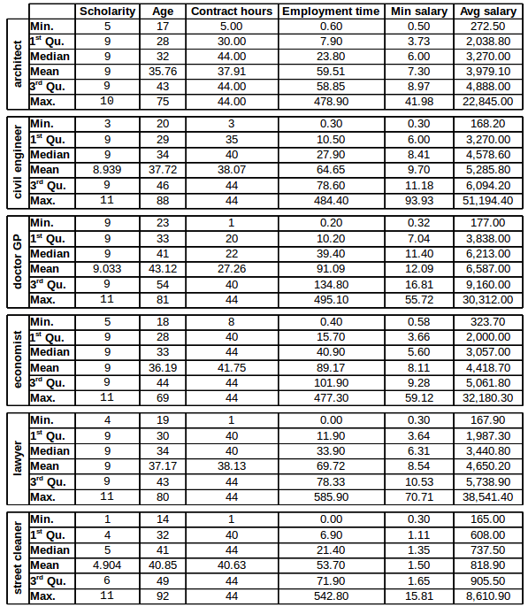

```{r setup, include=FALSE}
knitr::opts_chunk$set(echo = TRUE)
```
## The Datasets
In this report, I use datasets from the Brazilian Department of Labour, more specificaly from the RAIS report (Social Informations Annual Report). 
These datasets contain information about all people registered as regular workers for the selected professions in 2014, following the "CBO" (brazilian official classification of professions).

This information is available because in Brazil, every time that an employer contracts, promotes or terminates an employee contract, it's mandatory to include this information in the government system. For this study, we have six datasets, each one representing a different profession: architecture, medicine, engineering, economy, law and street cleaning.

## The Hypothesis:
Using this data, the objective is to identify how these different factors (age, gender, scholarity, profession, etc) can impact the average salary. More specificaly, I would like to identify:

1. Is there a difference between the average salary between genders? If it is the case, in which profession we have the biggest salary gap per gender?

2. What is the impact that scholarity have in the average salary?

3. How does the age affect the salary?

## Descritives
We have seven variables in each dataset: scholarity (years), age (years), contract hours (hours per week), employment time (months), minimum salary (salary compared to the minimum wage) and average salary (brazilian reais). The table bellow was generated collecting the R "summary" command output for each profession. Each entry also has information about the gender of the employee, but since this information is categorical, it was omitted from the table.



* **Number of observations:**

**Architect:** 599

**Civil Engineer:** 2.239

**Doctor:** 4.214

**Economist:** 961

**Lawyer:** 2.476

**Street Cleaner:** 49.001


# General Analysis for each variable:
* **Scholarity:**

Inside professions, the values are really concentrated around the mean, and because of that it wouldn't be very helpful to analyse the impact of this variable inside a profession. However, since we have professions with a considerable distance between the means (e.g. doctor against street cleaner), we will try to compare how it impacts the salary.

Bellow we have an graphical example of how close the values are from the mean for this variable. The dataset used for this plot was the "doctor general practice".

```{r}
library(ggplot2)
load(file="data/economist.Rdata")
load(file="data/street_cleaner.Rdata")
load(file="data/doctor_general_practice.Rdata")
meanE <- mean(doctor_general_practice$Scholarity)
std <- sd(doctor_general_practice$Scholarity)
plot = ggplot(data = doctor_general_practice, aes(doctor_general_practice$Scholarity)) + 
  geom_bar(fill="white", colour = "black") + labs(x= "scholarity (years)", y = "people") + 
  geom_vline(aes(xintercept = meanE, colour = "mean")) + 
  geom_vline(aes(xintercept = (meanE + std), colour = "std"), linetype = "dashed") +  
  geom_vline(aes(xintercept = (meanE - std), colour = "std"), linetype = "dashed")  + 
  geom_vline(aes(xintercept = median(doctor_general_practice$Scholarity), 
                 colour = "median"), linetype = "dashed") + 
  scale_colour_manual(name = "Legend", 
                      breaks = c("mean", "std","median"), 
                      values= c(mean = "red", std = "blue", median = "orange")) 
plot
```

* **Age:**

In Brazil, it's possible to work after the 14 years (maximum of 6 hours per day until 16), and that's why we have observations for this age for the street cleaning dataset. However, for the other professions, since it's expected from the employee to have more time of education in order to fulfill their tasks, we have a higher minimum. For all the profesisons, we have a higher number of registers around 25 years, a common age to finish studies, and also around this age people have more mobility between jobs.

In Brazil, the age for retirement in 2014 was 59 years.

```{r}
meanE <- mean(street_cleaner$age)
std <- sd(street_cleaner$age)
streetPlot = ggplot(data = street_cleaner, aes(street_cleaner$age)) + 
  geom_bar(fill="white", colour = "black") + labs(x= "age (years)", y = "people") + 
  geom_vline(aes(xintercept = meanE, colour = "mean")) + 
  geom_vline(aes(xintercept = (meanE + std), colour = "std"), linetype = "dashed") + 
  geom_vline(aes(xintercept = (meanE - std), colour = "std"), linetype = "dashed") + 
  geom_vline(aes(xintercept = median(street_cleaner$age), 
                 colour = "median"), linetype = "dashed") + 
  scale_colour_manual(name = "Legend", 
                      breaks = c("mean", "std","median"), 
                      values= c(mean = "red", std = "blue", median = "orange")) 
streetPlot
meanE <- mean(economist$age)
std <- sd(economist$age)
economistPlot = ggplot(data = economist, aes(economist$age)) + 
  geom_bar(fill="white", colour = "black") + labs(x= "age (years)", y = "people")+ 
  geom_vline(aes(xintercept = meanE, colour = "mean")) + 
  geom_vline(aes(xintercept = (meanE + std), colour = "std"), linetype = "dashed") + 
  geom_vline(aes(xintercept = (meanE - std), colour = "std"), linetype = "dashed") + 
  geom_vline(aes(xintercept = median(economist$age), 
                 colour = "median"), linetype = "dashed") + 
  scale_colour_manual(name = "Legend", 
                      breaks = c("mean", "std","median"), 
                      values= c(mean = "red", std = "blue", median = "orange")) 
economistPlot
```

* **Contract Hours:**

In Brazil, the maximum number of hours per week allowed is 44, what explains the means concentraring close to this number.

* **Employment Time:**

Employment time represents the quantity of months that the employee worked registered in the profession in question. The graphs plotted below show the employment time per amount of people, and at first sight it can leads us to the false conclusion that people abandon their profession over time. However, different from that, probably what happens to give this format to the graphs is the relation between age and employment time in the datasets. As saw in the explanation for age, the graph for number of employees has its peak around the twenties, and these employees do not have a lot of time as registered employees (since they just started their professional life!). 


```{r}
meanE <- mean(street_cleaner$employment_time)
std <- sd(street_cleaner$employment_time)
streetPlot = ggplot(data = street_cleaner, aes(street_cleaner$employment_time)) + 
  geom_bar(fill="white", colour = "black") + labs(x= "employment Time (months)", y = "people") + 
  geom_vline(aes(xintercept = meanE, colour = "mean")) + 
  geom_vline(aes(xintercept = (meanE + std), colour = "std"), linetype = "dashed") + 
  geom_vline(aes(xintercept = (meanE - std), colour = "std"), linetype = "dashed") + 
  geom_vline(aes(xintercept = median(street_cleaner$employment_time), 
                 colour = "median"), linetype = "dashed") + 
  scale_colour_manual(name = "Legend", 
                      breaks = c("mean", "std","median"), 
                      values= c(mean = "red", std = "blue", median = "orange")) 
streetPlot
meanE <- mean(economist$employment_time)
std <- sd(economist$employment_time)
economistPlot = ggplot(data = economist, aes(economist$employment_time)) + 
  geom_bar(fill="white", colour = "black") + labs(x= "employment Time (months)", y = "people")+ 
  geom_vline(aes(xintercept = meanE, colour = "mean")) + 
  geom_vline(aes(xintercept = (meanE + std), colour = "std"), linetype = "dashed") + 
  geom_vline(aes(xintercept = (meanE - std), colour = "std"), linetype = "dashed") + 
  geom_vline(aes(xintercept = median(economist$employment_time), 
                 colour = "median"), linetype = "dashed") + 
  scale_colour_manual(name = "Legend", 
                      breaks = c("mean", "std","median"), 
                      values= c(mean = "red", std = "blue", median = "orange")) 
economistPlot
```


* **Min Salary:**

This variable represent the relation between the employee salary and the brazilian minimum wage. In 2014, the national minimum wage was R$ 724,00. However, this number is not absolute, since some sectors and states have different agreements for their minimum wages. Since it makes the comparison complicated (and to retrieve this information is equally difficult) we will consider the national minimum wage as reference for the analysis here. 

The plot below is just an ilustration about how the minimum salary is just a different way of viewing the average salary. Because of that, it wouldn't make sense to include it in our set of possibles factors, and this variable will be excluded from further analysis in this report. 

```{r}
ggplot(data = economist, aes(economist$avg_salary, economist$min_salary)) + geom_point() + labs(y = "Avg Salary", x = "Min Salary") + geom_smooth()

```

* **Average Salary:**

The variable whose behaviour we wish to summarize in a model. In the next section we explore its relationship with the other variables of the datasets. 

## Variables of interest against Average Salary

Before jumping to comparisons between salary and other variables, I normalize the average salary to allow a fair comparison between the observation in our datasets. This normalization is needed because without it we could conclude that some cases in our dataset are receiving more or less money because of a given factor, where in fact it could only happen that theses people are working more than the others! Therefore, from now on I'm going to use the average salary divised by the number of hours worked, and I'm going to refer to this value as "normalized average salary".

A second transformation that I do in our target variable is not related to its meaning, but just an range transformation. In order to better visualize and summarize the normalized average salary, for this analysis we are going to apply a logarithm on it, since it does not change the values order, just scales it.

# Scholarity

As discussed before, for this comparison, is not very useful to look at the discrepancies inside a profession, and because of that, here we compare the emsemble of professions based solely on their normalized average salary and their scholarity.

```{r}
load(file="data/dataset.Rdata")
plot = ggplot(data= dataset, aes(factor(dataset$Scholarity), log(dataset$norm_avg_salary))) +
  geom_boxplot() + labs(x = "scholarity (years)", y = "log(normalized avg salary)") 
plot
```
# Age
```{r}
qplot(dataset$age, log(dataset$norm_avg_salary), ylab = "log(normalized avg salary)", xlab = "age", color = dataset$CBO2002) + geom_smooth(se = FALSE, method = "lm")

```

# Employment Time

# Gender

```{r}
plot = ggplot(data=dataset, aes(x= factor(dataset$gender, labels=c("men","women")), 
                                y=log(dataset$norm_avg_salary))) + 
  geom_boxplot() + labs(x = "gender", y = "Average Salary") 
plot
```


antigo


# Gender and Age against Average Salary
```{r}
ggplot(data = economist, aes(economist$age, log(economist$avg_salary)/ economist$contract_hours )) + geom_point(color = factor(economist$gender)) + labs(y = "Average Salary", x = "Age") + scale_colour_manual(name = "lol", breaks = "gender", values = c(gender = "blue"))
```


## Discussion
Because of the law structure in Brazil, it's possible to have underrepresentation for some professions (like doctors and lawyers, that sometimes register as partners in their business), and sometimes we also have a problem concerning the profession used for the registration, since sometimes a professional can be registered in two different ways (e.g. economists sometimes are registered as "analysts").

