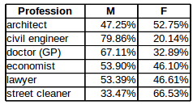

```{r setup, include=FALSE}
knitr::opts_chunk$set(echo = TRUE)
```
## The Datasets
In this report, I use datasets from the Brazilian Department of Labour, more specificaly from the RAIS report (Social Informations Annual Report). 
These datasets contain information about all people registered as regular workers for the selected professions in 2014, following the "CBO" (brazilian official classification of professions), and the entries are from one of the 27 Brazil states.

This information is available because in Brazil, every time that an employer contracts, promotes or terminates an employee contract, it's mandatory to include this information in the government system. For this study, we have six datasets, each one representing a different profession: architecture, medicine, engineering, economy, law and street cleaning.

## The Hypothesis:
Using this data, the objective is to identify how these different factors (age, gender, scholarity, profession, etc) can impact the average salary. More specificaly, I would like to identify:

1. Is there a difference between the average salary between genders? If it is the case, in which profession we have the biggest salary gap per gender?

2. What is the impact that scholarity have in the average salary?

3. How does the age affect the salary?

## Descritives
We have seven variables in each dataset: scholarity (years), age (years), contract hours (hours per week), employment time (months), minimum salary (salary compared to the minimum wage) and average salary (brazilian reais). The table bellow was generated collecting the R "summary" command output for each profession. Each entry also has information about the gender of the employee, but since this information is categorical, it was omitted from the table.


* **Number of observations:**

**Architect:** 599

**Civil Engineer:** 2.239

**Doctor:** 4.214

**Economist:** 961

**Lawyer:** 2.476

**Street Cleaner:** 49.001


# General Analysis for each variable:
* **Scholarity:**

Inside professions, the values are really concentrated around the mean, and because of that it wouldn't be very helpful to analyse the impact of this variable inside a profession. However, since we have professions with a considerable distance between the means (e.g. doctor against street cleaner), we will try to compare how it impacts the salary.

Bellow we have an graphical example of how close the values are from the mean for this variable. The dataset used for this plot was the "doctor general practice".

```{r}
library(ggplot2)
load(file="data/economist.Rdata")
load(file="data/street_cleaner.Rdata")
load(file="data/doctor_general_practice.Rdata")
load(file="data/architect.Rdata")
load(file="data/civil_engineer.Rdata")
load(file="data/lawyer.Rdata")
meanE <- mean(doctor_general_practice$Scholarity)
std <- sd(doctor_general_practice$Scholarity)
plot = ggplot(data = doctor_general_practice, aes(doctor_general_practice$Scholarity)) + 
  geom_bar(fill="white", colour = "black") + labs(x= "scholarity (years)", y = "people") + 
  geom_vline(aes(xintercept = meanE, colour = "mean")) + 
  geom_vline(aes(xintercept = (meanE + std), colour = "std"), linetype = "dashed") +  
  geom_vline(aes(xintercept = (meanE - std), colour = "std"), linetype = "dashed")  + 
  geom_vline(aes(xintercept = median(doctor_general_practice$Scholarity), 
                 colour = "median"), linetype = "dashed") + 
  scale_colour_manual(name = "Legend", 
                      breaks = c("mean", "std","median"), 
                      values= c(mean = "red", std = "blue", median = "orange")) 
plot
```

* **Age:**

In Brazil, it's possible to work after the 14 years (maximum of 6 hours per day until 16), and that's why we have observations for this age for the street cleaning dataset. However, for the other professions, since it's expected from the employee to have more time of education in order to fulfill their tasks, we have a higher minimum. For all the profesisons, we have a higher number of registers around 25 years, a common age to finish studies, and also around this age people have more mobility between jobs.

In Brazil, the age for retirement in 2014 was 59 years.

```{r}
meanE <- mean(street_cleaner$age)
std <- sd(street_cleaner$age)
streetPlot = ggplot(data = street_cleaner, aes(street_cleaner$age)) + 
  geom_bar(fill="white", colour = "black") + labs(x= "age (years)", y = "people") + 
  geom_vline(aes(xintercept = meanE, colour = "mean")) + 
  geom_vline(aes(xintercept = (meanE + std), colour = "std"), linetype = "dashed") + 
  geom_vline(aes(xintercept = (meanE - std), colour = "std"), linetype = "dashed") + 
  geom_vline(aes(xintercept = median(street_cleaner$age), 
                 colour = "median"), linetype = "dashed") + 
  scale_colour_manual(name = "Legend", 
                      breaks = c("mean", "std","median"), 
                      values= c(mean = "red", std = "blue", median = "orange")) 
streetPlot
meanE <- mean(economist$age)
std <- sd(economist$age)
economistPlot = ggplot(data = economist, aes(economist$age)) + 
  geom_bar(fill="white", colour = "black") + labs(x= "age (years)", y = "people")+ 
  geom_vline(aes(xintercept = meanE, colour = "mean")) + 
  geom_vline(aes(xintercept = (meanE + std), colour = "std"), linetype = "dashed") + 
  geom_vline(aes(xintercept = (meanE - std), colour = "std"), linetype = "dashed") + 
  geom_vline(aes(xintercept = median(economist$age), 
                 colour = "median"), linetype = "dashed") + 
  scale_colour_manual(name = "Legend", 
                      breaks = c("mean", "std","median"), 
                      values= c(mean = "red", std = "blue", median = "orange")) 
economistPlot
```

* **Contract Hours:**

In Brazil, the maximum number of hours per week allowed is 44, what explains the means concentraring close to this number.

* **Gender:**

Below, a table showing the gender distribution in our dataset, separated by profession.




* **Employment Time:**

Employment time represents the quantity of months that the employee worked registered in a company. The graphs plotted below show the employment time per amount of people. The graphs show us that we have a greater amount of people with small employment time. Considering that in general we are supposed to have much more younger people working (smaller employment time) than seniors (bigger employment time), the graphs format make sense.


```{r}
meanE <- mean(street_cleaner$employment_time)
std <- sd(street_cleaner$employment_time)
streetPlot = ggplot(data = street_cleaner, aes(street_cleaner$employment_time)) + 
  geom_bar(fill="white", colour = "black") + labs(x= "employment Time (months)", y = "people") + 
  geom_vline(aes(xintercept = meanE, colour = "mean")) + 
  geom_vline(aes(xintercept = (meanE + std), colour = "std"), linetype = "dashed") + 
  geom_vline(aes(xintercept = (meanE - std), colour = "std"), linetype = "dashed") + 
  geom_vline(aes(xintercept = median(street_cleaner$employment_time), 
                 colour = "median"), linetype = "dashed") + 
  scale_colour_manual(name = "Legend", 
                      breaks = c("mean", "std","median"), 
                      values= c(mean = "red", std = "blue", median = "orange")) 
streetPlot
meanE <- mean(economist$employment_time)
std <- sd(economist$employment_time)
economistPlot = ggplot(data = economist, aes(economist$employment_time)) + 
  geom_bar(fill="white", colour = "black") + labs(x= "employment Time (months)", y = "people")+ 
  geom_vline(aes(xintercept = meanE, colour = "mean")) + 
  geom_vline(aes(xintercept = (meanE + std), colour = "std"), linetype = "dashed") + 
  geom_vline(aes(xintercept = (meanE - std), colour = "std"), linetype = "dashed") + 
  geom_vline(aes(xintercept = median(economist$employment_time), 
                 colour = "median"), linetype = "dashed") + 
  scale_colour_manual(name = "Legend", 
                      breaks = c("mean", "std","median"), 
                      values= c(mean = "red", std = "blue", median = "orange")) 
economistPlot
```

It's also interesting to explore the relationship between age and employment time. Does increasing the age mean increasing the employment time? Below I ploted these two, and tried to fit a linear model. 

```{r}
load(file="data/dataset.Rdata")
plot = ggplot(data = dataset, aes(dataset$age,dataset$employment_time, color = dataset$CBO2002)) + 
  geom_point() + labs(y = "employment time", x = "age") + geom_smooth(method= "lm",color=  "black", formula = y ~ 0 + x)+
  facet_wrap(~ dataset$CBO2002) + theme(legend.title=element_blank())
plot
```

In this model, I removed the intecept, since it would give unreasonable values for the variables in question (in no scenario a person with zero age would already have time of employment). Also, the graph above makes us think about the correlation between the variables, expressed bellow:

```{r}
cor(dataset$employment_time, dataset$age)
```

The variables are definately positively correlated, but the correlation score is not that high. That and considering that we have a big cloud of points which can affect Pearson's correlation (since it is affected by the sample size), both variables were kept for the analysis.

* **Min Salary:**

This variable represent the relation between the employee salary and the brazilian minimum wage. In 2014, the national minimum wage was R$ 724,00. However, this number is not absolute, since some sectors and states have different agreements for their minimum wages. Since it makes the comparison complicated (and to retrieve this information is equally difficult) we will consider the national minimum wage as reference for the analysis here. 

The plot below is just an ilustration about how the minimum salary is just a different way of viewing the average salary. Because of that, it wouldn't make sense to include it in our set of possibles factors, and this variable will be excluded from further analysis in this report. 

```{r}
plot = ggplot(data = economist, aes(economist$avg_salary, economist$min_salary)) + 
  geom_point() + labs(y = "Avg Salary", x = "Min Salary") + geom_smooth()
plot
```

* **Average Salary:**

The variable whose behaviour we wish to summarize in a model. In the next section we explore its relationship with the other variables of the datasets. 

```{r}

 # geom_point() + labs(y = "employment time", x = "age") + geom_smooth(method= "lm",color=  "black", formula = y ~ 0 + x)+
#  facet_wrap(~ dataset$CBO2002) 

plot = ggplot(data = dataset, aes(dataset$avg_salary, color = dataset$CBO2002)) + 
  geom_histogram(fill = "white", bins = 50) + labs(x= "average salary", y = "people") +
  facet_wrap(~ dataset$CBO2002) + theme(legend.title=element_blank())
plot
```

This plot above is an histogram of the average salary per profession, and it does not give us a lot of information. It is difficult to have a suitable bucket number while not charging the visualization. Therefore, in the next section I start discussing how to scales this variable, in order to simplify the visualization and help the analysis.

## Variables of interest against Average Salary

Before jumping to comparisons between salary and other variables, I normalize the average salary to allow a fair comparison between the observation in our datasets. This normalization is needed because without it we could conclude that some cases in our dataset are receiving more or less money because of a given factor, where in fact it could only happen that theses people are working more than the others! Therefore, from now on I'm going to use the average salary divised by the number of hours worked, and I'm going to refer to this value as "normalized average salary".

A second transformation that I do in our target variable is not related to its meaning, but just an range transformation. In order to better visualize and summarize the normalized average salary, for this analysis we are going to apply a natural logarithm on it, since it does not change the values order, just scales it.

It is important to consider that applying the log operation on the average salary will change the interpretation of the results for the final regression, and it will be interpreted as the percentage salary variance given the absolute variance for the other variables.

# Scholarity

As discussed before, for this comparison, is not very useful to look at the discrepancies inside a profession, and because of that, here we compare the emsemble of professions based solely on their normalized average salary and their scholarity.

```{r}
plot = ggplot(data= dataset, aes(factor(dataset$Scholarity), log(dataset$norm_avg_salary))) +
  geom_boxplot() + labs(x = "scholarity (years)", y = "log(normalized avg salary)") 
plot
```

This visualization help us to identify a possible relationship between the salary and the scholarity. Although between the first seven years of scholarity we do not seem to have a considerable difference, from the eighth to the nineth year, it seems to impact drastically the average salary of the employee.

When plotting this, the first thing that I thought was: but, it is fair? My fear was that I would be comparing two disjoint sets: a set that goes from one year of scholarity to eight, and a different set of professions that require at least nine years of scholarity. However, fortunately, after plotting scholarity per profession (below) I was able to see that, even if we do have a profession where it seems to be a requirement to be above eight (medicine), all the others professions overlap, what makes the comparison valid.


```{r}
plot = ggplot(data= dataset, aes(factor(dataset$Scholarity), log(dataset$norm_avg_salary))) +
  geom_boxplot() + labs(x = "scholarity (years)", y = "log(normalized avg salary)") +
  facet_wrap(~ dataset$CBO2002) 
plot
```

# Age
```{r}
plot = ggplot(data = dataset, aes(dataset$age, log(dataset$norm_avg_salary), 
                                  color = dataset$CBO2002)) + geom_point() + 
  geom_smooth(color = "black") + labs(x = "age", y = "log(normalized avg salary)") + 
  facet_wrap(~ dataset$CBO2002) + theme(legend.title=element_blank())
plot
```

# Employment Time

```{r}
plot = ggplot(data = dataset, aes(dataset$employment_time, log(dataset$norm_avg_salary), 
                                  color = dataset$CBO2002)) + geom_point() + 
  geom_smooth(color = "black", method = lm) + labs(x = "employment time", 
                                      y = "log(normalized avg salary)") +
  facet_wrap(~ dataset$CBO2002) + theme(legend.title=element_blank())
plot
```

Similar as when comparing age with employment time, the observations seem to have a huge variability.

# Gender

```{r}
plot = ggplot(data=dataset, aes(x= factor(dataset$gender, labels=c("men","women")), 
                                y=log(dataset$norm_avg_salary))) + 
  geom_boxplot() + labs(x = "gender", y = "log(normalized avg salary)") 
plot
```


```{r}
plot = ggplot(data=dataset, aes(x= factor(dataset$gender, labels=c("men","women")), 
                                y=log(dataset$norm_avg_salary))) + 
  geom_boxplot() + labs(x = "gender", y = "log(normalized avg salary)") +
  facet_wrap(~ dataset$CBO2002) 
plot
```


## Mincer Earnings Function
The Mincer earnings function was published in 1974 and it models the salary in function of years of education (scholarity), experience in the market (here approximated by the age) and other factors (such as gender and employment time). It is one of the most widely used models in empirical economics, and more information can be found at [1].

The Mincer model used in this report is the combination of all the variables investigated in the last section. It is defined as follows:

ln norm_avg_salary = B0 + B1 scholarity + B2 age + B3 age^2 + + B4 gender + B5 employment_time + error

Where B0 is the salary of an individual with no education and no experience, and B1, B2, B3, B4 and B5 are the adjust parameters.

```{r}
reg = lm(data = dataset, 
         formula = log(dataset$norm_avg_salary) ~ dataset$Scholarity + 
           dataset$age + dataset$gender + dataset$employment_time  + 
           I(dataset$age^2))

summary(reg)
```

The regression summary confirms the relationship between our factor and response variables, discarting totally the null hypothesis. However, we do not have a good adjusted R-squared value (only 0.5674), what probably can be explained by the noisy nature of our dataset, thing that was illustrated in the last section and it is again shown in the plot bellow:

```{r}
plot = ggplot(data = dataset, aes(log(dataset$norm_avg_salary),dataset$age)) + 
  geom_point() + geom_smooth(method = lm, formula = y ~ x + I(x^2))
plot
```

With this level of noise, I would say it is impossible to fit a model with a very good R-squared value!

Also, a pitfall that I fell when I was trying to fit this regression was to remove the intercept for this model, which give us the summary bellow:

```{r}
reg = lm(data = dataset, formula = log(dataset$norm_avg_salary) ~ 0 + 
           dataset$Scholarity + dataset$age + dataset$gender + 
           dataset$employment_time  + I(dataset$age^2))
summary(reg)
```

Looking just at the adjusted R-squared, it looks a perfect fit. However, removing the intercept (B0 at the mincer model defined above) is not right for two reasons. First because it is part of the model, and therefore it has a weight on it. The second reason I discovered after some research, looking at the discussion at [2]. 

Basically, what happens when one removes the intercept is that R uses a modified form of the equation to compare the current model to the reference model (that only contains the intercept). Since it does not have the intercept, it implicitly uses as reference model a model made of noise only. In cases as this dataset, where we have a huge cloud of points, this factor ends up dominating the value, giving us the false impression of fitting. 

Finally, a final hint that removing the intercept is not a good idea, is our number of degrees of freedom, which is ridiculously small compared to the size of our dataset (49.001 observations).

## Looking at each profession 
In the regression that was made, we considered the whole dataset. This is problematic because we are assuming that the relationship is the same between these factors and the response variable. 

For example, maybe age for street cleaning is a factor that affects the salary greatly, lowering it, while for professions like medicine, it could mean that this doctor is more experienced and therefore the salary would be better. Therefore, in this section we explore the different relationships for the different professions.


### Architect
```{r}
reg = lm(data = architect, formula = log(architect$norm_avg_salary) ~ + 
           architect$Scholarity + architect$age + architect$gender + 
           architect$employment_time  + I(architect$age^2))
summary(reg)
```


### Civil Engineer
```{r}
reg = lm(data = civil_engineer, formula = log(civil_engineer$norm_avg_salary) ~ + 
           civil_engineer$Scholarity + civil_engineer$age + civil_engineer$gender + 
           civil_engineer$employment_time  + I(civil_engineer$age^2))
summary(reg)
```

### Doctor General Practice
```{r}
reg = lm(data = doctor_general_practice, 
         formula = log(doctor_general_practice$norm_avg_salary) ~ + 
           doctor_general_practice$Scholarity + doctor_general_practice$age + 
           doctor_general_practice$gender + 
           doctor_general_practice$employment_time  + 
           I(doctor_general_practice$age^2))
summary(reg)
```

### Economist
```{r}
reg = lm(data = economist, formula = log(economist$norm_avg_salary) ~ + 
           economist$Scholarity + economist$age + economist$gender + 
           economist$employment_time  + I(economist$age^2))
summary(reg)
```

### Lawyer
```{r}
reg = lm(data = lawyer, formula = log(lawyer$norm_avg_salary) ~ + 
           lawyer$Scholarity + lawyer$age + lawyer$gender + 
           lawyer$employment_time  + I(lawyer$age^2))
summary(reg)
```

### Street Cleaner
```{r}
reg = lm(data = street_cleaner, formula = log(street_cleaner$norm_avg_salary) ~ + 
           street_cleaner$Scholarity + street_cleaner$age + street_cleaner$gender + 
           street_cleaner$employment_time  + I(street_cleaner$age^2))
summary(reg)
```

### Discussion
It seems that Mincer model for the normal logarithm of the normalized salary was well fitted for most of the professions, the profession doctor the drastic case where it seems to only have significant relation the employment time and maybe scholarity. Now, with these models, I will try to answer the questions that I presented in the beginning of the document:

**1. Is there a difference between the average salary between genders? If it is the case, in which profession we have the biggest salary gap per gender?**

The regressions (excluding the doctor dataset) gave us the prove that the gender is a variable that helps us to explain the model, which means it has an impact in the salary. 
Then, with this information we can calcule the difference between the salary for a woman and a man in a profession, to find the biggest gap:

* architect: -0.0116690918024

* civil engineer: 0.139170680059

* **economist: 0.521903520552**

* lawyer: 0.288922295832

* street cleaner: 0.230664127093

These values are in percentage. The profession economist, where we have the biggest salary gap, is a field with discrepancy close to 0.52% between salaries. At the same time, it is interesting to notice the profession architect, where women gain more than men (approximately 0.01%)!

**2. What is the impact that scholarity have in the average salary?**
In our datasets, the street cleaner seems to be the only profession with representability for all levels of scholarity. There, we found a considerable increase between 4 to 5 (0.44%) and between 6 and 7 (0.42%). However, I would know how to explain the decreases that we see between 5 and 6 without further investigation, that will not be realized here due to lack of time.

```{r}
load(file="data/avg_street_cleaner.Rdata")
plot(factor(avg_street_cleaner$V1), avg_street_cleaner$V2, 
            ylab = "log(normalized avg salary)", xlab = "scholarity")
```

**3. How does the age affect the salary?**

```{r}
plot = ggplot(data = dataset, aes(dataset$age, log(dataset$norm_avg_salary), 
                                  color = dataset$CBO2002)) + geom_point() + 
  geom_smooth(color = "black", method = lm, formula = y ~ x + I(x^2)) +
  labs(x = "age", y = "log(normalized avg salary)") + 
  facet_wrap(~ dataset$CBO2002) + theme(legend.title=element_blank())
plot
```
The age affects the salary in two different ways, here interpreted as: gain and the loss of produtivity when getting older. The interpretation is that the salary increases with the age until a "golden age", after which it starts to decrease.


## Conclusion
Because of the law structure in Brazil, it's possible to have underrepresentation for some professions (like doctors and lawyers, that sometimes register as partners in their business), and sometimes we also have a problem concerning the profession used for the registration, since sometimes a professional can be registered in two different ways (e.g. economists sometimes are registered as "analysts").

I was able to identify a salary discrepancy for almost all the datasets, and I was also able to confirm the quadratic relation between the age and the salary, following the Mincer model for earnings. 

I didn't conclude much from the scholarity variable (besides the fact that it affects the final salary) and it requires further analysis.

## References

* [1] Sites aboutt Mincer Earnings Function:

https://en.wikipedia.org/wiki/Mincer_earnings_function

http://eml.berkeley.edu/~cle/wp/wp62.pdf

http://www.cps.fgv.br/cps/pesquisas/Politicas_sociais_alunos/2011/pdf/BES_EquacaoMinceriana.pdf (in portuguese)

* [2] Removing statistically significant intercept term increases R² in linear model:

http://stats.stackexchange.com/questions/26176/removal-of-statistically-significant-intercept-term-increases-r2-in-linear-mo


